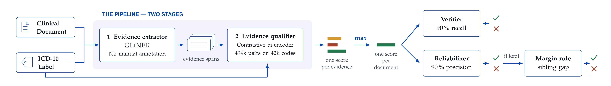

# Verifying ICD-10 Labels in Clinical Corpora

Code, models, data and annotated evaluation sets for the paper *Verifying ICD-10 Labels in
Clinical Corpora*, plus the material needed to check every number in it. The label-verification
pipeline is one component of the PARTAGES / CU2 project, not the whole of it.

A trained ICD-10 coder is only as good as the labels it was trained on. This pipeline asks, for
any (text, code) pair, whether the text actually attests the code, and filtering a corpus with
it produces a measurably better coder.



## Code: three repositories

The pipeline has three components, each its own repository, installable and runnable on its own.
This one holds what binds them for this paper: the evaluation sets, the predictions and the
analysis.

| Stage | Repository | What it does |
|---|---|---|
| 1. extract | [partages-cu2-icd-evidence-extractor](https://github.com/aphp-datascience/partages-cu2-icd-evidence-extractor) | GLiNER, conditioned on the code's official label, proposes candidate evidence spans. No manual annotation, and cross-fitted so no document is scored by a model that saw it |
| 2. qualify | [partages-cu2-icd-evidence-qualifier](https://github.com/aphp-datascience/partages-cu2-icd-evidence-qualifier) | Contrastive bi-encoder trained on code–synonym pairs from the terminology. Scores each span; a document's score is its best span |
| downstream | [partages-cu2-encoder-baseline](https://github.com/aphp-datascience/partages-cu2-encoder-baseline) | Document-level ICD-10 classifier. The consumer: it measures what filtering a training corpus is worth |

Two thresholds read the document score: a permissive **verifier** and a stricter
**reliabilizer**. On what the reliabilizer keeps, the **margin rule** adds a second test, requiring
the labelled code to lead its best taxonomic sibling by a calibrated margin. All three thresholds
are calibrated on `annotations/syn-cal300.csv`, never on a corpus this work evaluates.

Those three modes are what the paper's Table 1 reports, and they live in neither component
repository: the
qualifier emits scores, the decision is taken here. [`pipeline/modes.py`](pipeline/modes.py) is
their reference implementation, with the five choices that change the numbers and that the paper's
prose does not pin down (what counts as a sibling, when the conjunction is evaluated, what happens
to a document with no evidence). It is a specification, not a demo: the released annotations carry
no sibling scores, so nothing here exercises the margin. `python pipeline/modes.py` runs its
self-test on a fixture.

## Models

| Model | Where | Status |
|---|---|---|
| Evidence qualifier (`RR+LN`, 6 checkpoints) | Hugging Face Hub | **release in progress** |
| Evidence extractor | GLiNER, cross-fitted over folds; see the extractor repo | not released as weights |
| Downstream coder | CamemBERTa-v2 + attention pooling; recipe in `provenance/configs/` | not released as weights |

⚠️ **The qualifier is an ensemble and cannot be collapsed.** `RR+LN` is the **mean of six
checkpoints' cosine similarities**, not one set of weights: two training variants, `RR` and `LN`,
at three seeds each. Those two names appear in the checkpoint filenames and in the `cos_rr_ln`
column of the annotations; [MODELS.md](MODELS.md) says what each variant changes. Averaging the weights gives a
different model, and so does averaging probabilities: the mean does not commute with the
sigmoid, so pooling must happen on the cosines, before any calibrated threshold is applied.

Weights go to the Hub rather than to git: 444 MB per checkpoint, and the Hub gives model cards,
versioning and a resolvable identifier. For this model the weights are the **only faithful
record**: several of its training settings were read from environment variables that no run
manifest captured, so its recipe alone does not reconstruct it. Details and the integrity
checks: [MODELS.md](MODELS.md).

## Data

| Corpus | Role | Where |
|---|---|---|
| **PARHAF** (Tannier et al., 2026) | Test set, 288 physician-written reports, principal diagnosis in outpatient surgery | [`HealthDataHub/PARHAF`](https://huggingface.co/datasets/HealthDataHub/PARHAF), public, CC BY 4.0 + Etalab 2.0 |
| **Generated corpus** | Training corpus, 11,605 LLM-generated surgery reports over 886 codes | **release in progress** |

PARHAF describes **fictitious** patients. No real patient data is involved, here or anywhere in
this pipeline. Only its public part is ever read, and no token is needed.

The pipeline cannot be assessed on the generated corpus itself: the LLM writes *from* the target
code, so the text echoes the expected phrasing and the corpus is **self-attesting**. Sensitivity
is therefore measured by injecting known label errors into PARHAF.

## Annotated evaluation sets

**1,200 (code, passage) pairs**, each judged for whether the passage attests the code. This is the
part of the release that is hardest to rebuild and most reusable outside this project: it
evaluates any model that scores a code against a passage of French clinical text.

| File | Pairs | Origin | Used for |
|---|---|---|---|
| `annotations/real-dev400.csv` | 400 | passages from **physician-written** PARHAF reports | ROC-AUC on real text: **0.95** |
| `annotations/syn-clin500.csv` | 500 | passages from generated reports | ROC-AUC on generated text: **0.82** |
| `annotations/syn-cal300.csv` | 300 | generated, stratified by extraction score | threshold calibration: 0.19 / 0.54, margin +0.06 |

Every pair carries its three annotation passes, the pooled cosine of the released ensemble, and
the majority label used in the paper. ⚠️ Two of the three passes come from the **same** model
under two prompts, so their agreement measures prompt stability, not inter-annotator agreement.
Schema, provenance and caveats: [annotations/README.md](annotations/README.md).

## Reproducing the paper

Three levels, each an order of magnitude more expensive than the last.

| Level | What you re-do | Needs | Cost |
|---|---|---|---|
| **1. verify** | Re-render every table and figure from the released numbers | this repo | seconds |
| **2. re-analyse** | Recompute every contrast, confidence interval and subgroup from the per-patient predictions | this repo | minutes, CPU |
| **3. retrain** | Re-run the pipeline end to end | the corpora and the three repositories above | GPU-weeks |

```bash
python analysis/table1.py                                # the paper's Table 1, below
python analysis/contrasts.py filt_v4_veto rnd_v4_veto    # the headline +13.0, with its CI
python analysis/section2.py                              # ROC-AUC 0.95 / 0.82, threshold 0.5375
python analysis/parhaf_testset.py                        # rebuild the 288 cases, audit dp_gold
```

`analysis/` is levels 1 and 2 and runs on `annotations/` and `predictions/` alone: no model, no
inference, four dependencies. `table1.py` prints the table the rest of this README refers to,
**Table 1 of the paper**, micro-F1 on the 288 PARHAF cases averaged over six seeds:

```
                                       native corpus                    30% corrupted
                                      N     micro-F1   Δ ctrl.          N     micro-F1   Δ ctrl.
  ----------------------------------------------------------------------------------------------
  No filter                       11,605    41.1 ±1.5       ---    11,605    28.6 ±1.0       ---
  Verifier filter                 11,573    39.7 ±3.1      -1.5    10,617    30.5 ±1.4      +2.5
    same-size random drop                   41.2 ±1.9                        28.0 ±2.5
  Reliabilizer filter              9,771    42.2 ±1.2      +0.8     7,488    37.6 ±2.2      +8.6
    same-size random drop                   41.4 ±1.2                        28.9 ±2.0
  Reliabilizer filter + margin     7,977    43.3 ±0.8      +1.9     6,670    41.8 ±1.5     +13.0
    same-size random drop                   41.4 ±1.2                        28.9 ±2.9
```

Each filter is followed by its own size-matched random drop: the comparison that means something
is the vertical one, against the line directly below, never against the unfiltered corpus.

⚠️ **Level 2 does not re-run inference.** It recomputes the statistics from predictions that were
already written, so it verifies the whole analysis, where the paper's claims live, but
not that those predictions came from the models. Checking that is level 3.

⚠️ **Level 3 is reproduction, not bit-identical replay.** Same recipe, same data, same seed gives
a model within the inter-seed standard deviation the paper prints, but never the same weights. GPU
kernels, mixed precision and dataloader ordering are not deterministic.

⚠️ **Read a contrast with `contrasts.py`, never off the table above.** The `±` there is an inter-seed
standard deviation; it hides the sampling of the 288 patients, which sets a floor of ±1.6 to
±3.5 pp that no number of seeds reduces. A gain consistent on all six seeds can still fail to
clear it: the native `+1.9` does. See [analysis/README.md](analysis/README.md), which also lists
the paper's numbers this repository cannot reach.

## What is here

```
docs/pipeline.png                       the figure above
pipeline/modes.py                       verifier, reliabilizer and margin rule, with thresholds
analysis/table1.py                      regenerates the paper's Table 1 from the predictions
analysis/contrasts.py                   paired per-patient contrast, CI and McNemar
analysis/section2.py                    ROC-AUCs and the calibrated thresholds
analysis/parhaf_testset.py              rebuilds the test set from PARHAF, audits dp_gold
annotations/*.csv                       1,200 annotated (code, passage) pairs for §2
predictions/<arm>-s<seed>.parquet       84 runs × 288 patients, §3 and the table above
provenance/
  configs/<family>/<run>/config.yml     90 resolved training configs
  runs_summary.csv                      84 runs: final loss, micro/macro P/R/F, steps, seed
  checkpoints_sha256.txt                6 qualifier checkpoints
archive/                                full training histories (gitignored, see below)
```

**Scope: only the runs behind a number in the paper.** The study explored 149 encoder arms; 135 of
them answer questions the paper does not report, and shipping them would invite a reader to
reconstruct results we chose not to claim. What is here is the 14 arms of the table at 6 seeds, plus
the 6 checkpoints of the qualifier.

| Row of the table | native corpus | 30% corrupted |
|---|---|---|
| No filter | `clean` | `noisy` |
| Verifier filter | `clean_v4_verif` | `filt_v4_verif` |
| ⟶ same-size random drop | `cln_rnd_v4_verif` | `rnd_v4_verif` |
| Reliabilizer filter | `clean_v4_fiab` | `filt_v4_fiab` |
| ⟶ same-size random drop | `cln_rnd_v4_fiab` | `rnd_v4_fiab` |
| Reliabilizer filter + margin | `clean_v4_veto` | `filt_v4_veto` |
| ⟶ same-size random drop | `cln_rnd_v4_veto` | `rnd_v4_veto` |

Each name takes the suffix `-s42` … `-s47`. The qualifier is
`stepNOISEA-xE-contr{RR,LN}-s4{2,3,4}`.

**`provenance/configs/` is the important part.** These are *resolved* configs, not templates:
corpus paths, backbone, `max_step`, `loss_scale` and referential are substituted in. With the
seed, encoded in the run name, each file is the complete recipe for one run.

`runs_summary.csv` carries one row per run: family, arm, seed, steps, final loss, micro and macro
precision/recall/F1. These are each run's own validation figures on the generated corpus; the
paper's numbers come from re-scoring the saved predictions on the 288 PARHAF cases, which is what
level 2 does. The full per-step histories, including the per-code breakdown over all 886 codes,
are 860 MB raw and are kept as a compressed archive outside git.

## Known gap in the provenance

Training runs wrote a manifest recording the commit, the resolved config and the data
fingerprints. Of the 74 that survive, **not one captured the environment variables**, and none of
the 74 documents a run reported in the paper, which is why no manifest is shipped here.

For the encoder the gap is harmless: its configuration lives entirely in the config file, so
`provenance/configs/` is complete. For the **qualifier** it is not: several of its training
settings are read from the environment and are recorded nowhere, so its runs cannot be
reconstructed exactly from this repository. The same gap explains why the qualifier contributes no
row to `runs_summary.csv`: no per-run metrics survive under an identifiable arm name for its six
checkpoints. That is why its weights are published rather than only its recipe.

## License

Apache 2.0, see [LICENSE](LICENSE). PARHAF passages quoted in `annotations/real-dev400.csv` are
reproduced under CC BY 4.0 / Etalab 2.0; cite PARHAF if you use them.
